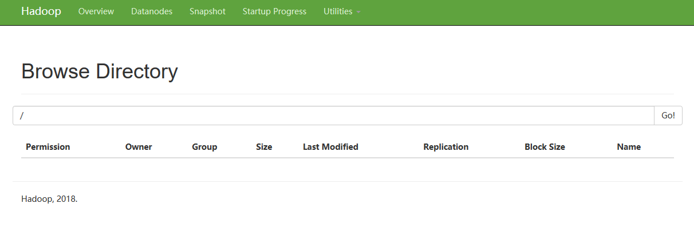

# Hadoop 之 HDFS

## HDFS 产生的背景

目前社会产生的数据量越来越大，但是在一台服务器上很难存下这么大量的数据，至此就需要多台服务器分布式的存储这些大量数据，但是分布式的存储又涉及到管理和维护这些数据的问题，所以迫切需要一种系统来管理多台服务器机器上的文件，这就是分布式文件管理系统，分布式文件管理系统有很多，HDFS 只是其中之一。

------------------------------

## HDFS 的定义

Hadoop 官网的原话是：**Hadoop Distributed File System (HDFS): A distributed file system that provides high-throughput access to application data.**

意思是：HDFS 是一个可以给应用程序提供高吞吐量的 Hadoop 的分布式文件系统（分布式文件系统）；

详细的说，HDFS 是一个文件系统，用于存储文件，并且通过目录树来定位文件；其次它是分布式的，由很多服务器联合起来实现其功能，集群中的服务器也扮演着各自的角色。

------------------------------

## HDFS 的使用场景

HDFS 并不适用于所有场景，且不支持文件的修改。

HDFS 适合的使用场景：一次写入，多次读出的场景。所以 HDFS 适合用来做数据分析而不适合用来做大量增删改相关操作的服务，HDFS 的读写速度慢，所以也不能做一些实时处理的任务。

------------------------------

## HDFS 的优缺点

优点：
- 高容错性，数据自动保存多个副本（默认保存 3 个副本），且某一个副本丢失以后可以自动恢复；
- 适合处理大数据，HDFS 能够处理数据规模达到 GB、TB 甚至 PB 级别的数据，且能够处理百万规模以上的文件数量；
- 可搭建在廉价的机器上，多个廉价的机器通过多副本机制，提高可靠性；
- 适合批处理，即对数据的离线处理。
 
缺点：
- 不适合低延迟的数据访问，做不了实时处理；
- 无法高效的对大量的小文件进行存储，因为存储大量小文件的话，它会占用 NameNode 大量的存储空间来存储文件目录和块信息，但这是不可取的，因为 NameNode 存储目录的大小总是有限的，其次小文件存储的寻址时间会超过读取时间，这违背了 HDFS 的设计目的；
- 不支持并发写入和文件的随机修改，意思是即一个文件只能由一个线程写，不允许多个线程同时写，且仅支持数据的追加（append），不支持文件的随机修改。

------------------------------

## HDFS 的组成架构

下图是官网给出的 HDFS 的组成结构：

从官网给出的图片来看，我们可以知道 HDFS 是一个主从架构，即一个主节点，多个从节点的设置，也可以看出 HDFS 是以何种形式存储数据的。HDFS 正常启动的时候是有三个进程的，分别是：NameNode、DataNode 和 SecondaryNameNode。

### NameNode

NameNode 主要用于存储元数据和处理客户端的读写请求。

**注：元数据是指描述数据的信息的数据。**

这里的元数据包含三部分内容，分别是「抽象目录树」、「数据与数据块之间的关系」和「数据块分别存储在哪些节点上」。

首先讲一下什么是「抽象目录树」，下图是启动 HDFS 后的集群相关的页面，进入导航栏的 Utilities->Browse the file system，我们可以看到一个类似于 Linux 的文件目录结构。

但为什么要叫「抽象目录树」呢？这是因为在 HDFS 上的文件，是分块分布在多个节点上，而这个目录所显示的是一个整体，但底层却是多个节点协同存储，所以是抽象出来的目录而不是真正意义上的单节点目录。

再讲一下什么是「数据与数据块之间的关系」和「数据块分别存储在哪些节点上」。我们知道上传到 HDFS 上的文件是被拆分成多个数据块被存储在不同的节点上的，那么 NameNode 就需要知道哪个数据块对应哪个文件的哪部分数据，这就是「数据与数据块之间的关系」，另外 NameNode 也需要知道每个数据块分别存放在哪些 DataNode 的节点上，这样才能准确的从对应的 DataNode 的节点上找到数据，这就是为什么要知道「数据块分别存储在哪些节点上」的原因。

如果用户需要访问一个 HDFS 上的数据时，是先经过 NameNode 的，所以 NameNode 需要处理客户端发送来的读写请求。

### DataNode

DataNode 是真正的负责存储数据（这里的数据是指文件被拆分出来的多个数据块）且真正的处理读写操作。

**注：区分一下 NameNode 和 DataNode，NameNode 存储的是元数据，而 DataNode 存储的是真正的数据本身；NameNode 是处理读写请求，而 DataNode 是处理真正数据的读写操作。**

### SecondaryNameNode

SecondaryNameNode 叫作冷备份节点，可以理解为 SecondaryNameNode 是 NameNode 的助理。SecondaryNameNode 的作用是当 NameNode 宕机时去帮助 NameNode 恢复，其次也帮助 NameNode 做一些事情，分担 NameNode 的压力。

那 SecondaryNameNode 是如何帮助 NameNode 恢复的呢？其实 SecondaryNameNode 中存储的数据和 NameNode 中基本相同（这里说基本是因为 SecondaryNameNode 无法做到与 NameNode 实事同步），所以当 NameNode 中的元数据丢失时 SecondaryNameNode 可以在数据层面恢复 NameNode。

这里把 SecondaryNameNode 叫做冷备份节点是因为他不能主动切换或者恢复 NameNode，需要管理员手动从 SecondaryNameNode 中还原 NameNode，但因为 NameNode 和 SecondaryNameNode 之间并不会完全数据同步（即有时间差），所以一般也不会利用 SecondaryNameNode 手动还原 NameNode。

