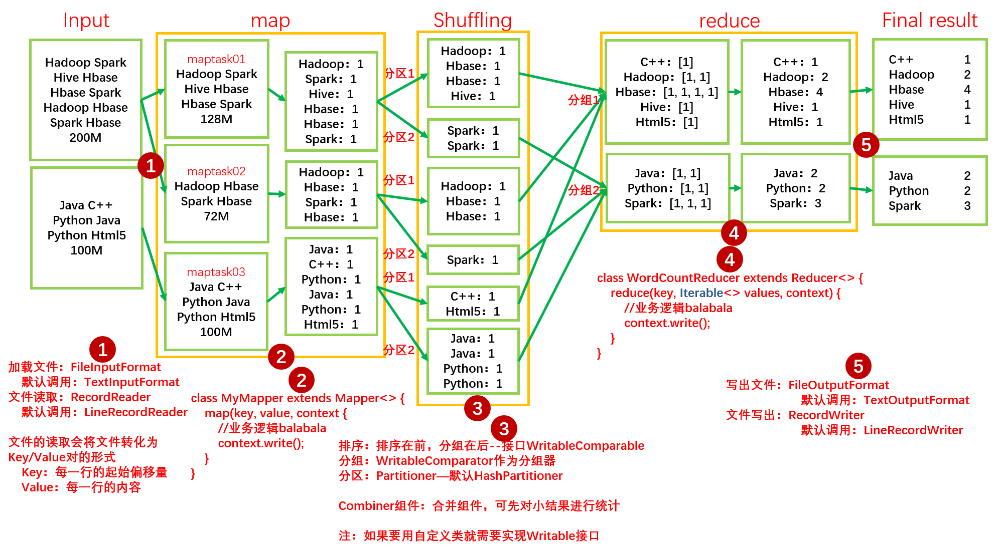

# Hadoop 之 MapReduce

## MapReduce 概述

MapReduce 是一个**分布式运算程序的编程框架**，是用户开发「基于 Hadoop 的数据分析应用」的核心框架。

MapReduce 核心功能是将**用户编写的业务逻辑代码**和**自带默认组件**整合成一个完整的**分布式运算程序**，**并发**运行在一个 Hadoop 集群上。


## MapReduce 的优缺点

优点：

- MapReduce 易于编程：我们只要简单的实现一些接口，就可以完成一个分布式程序，这个分布式程序可以分布到大量廉价的 PC 机上运行。也就是说，我们写一个分布式程序就如同写一个简单的串行程序一样。就是因为这个特点，使得 MapReduce 编程变得非常流行；
- 良好的扩展性：当我们的计算资源得不到满足的时候，我们可以通过简单的增加机器来扩展集群的计算能力；
- 高容错性：MapReduce 设计的初衷就是使程序能够部署在廉价的 PC 机上，这就要求 MapReduce 具有很高的容错性。假如 MapReduce 在运行当中，即便集群中运行计算的其中一台机器挂了，MapReduce 也可以把这台机器上的计算任务转移到另外一个节点上运行，以防止这个任务运行失败，并且这个转移的过程完全由 Hadoop 内部完成，不需要人工参与；
- 适合 PB 级以上的海量数据的离线处理：可以实现上千台服务器集群的并发工作，提供数据处理能力。

缺点：

- 不擅长实时计算：MapReduce 无法像 MySQL 一样，在毫秒或者秒级内返回结果；
- 不擅长流式计算：流式计算的输入数据是动态的，而 MapReduce 的输入数据集是静态的，不能动态变化。这是因为 MapReduce 自身的设计特点决定了数据源必须是静态的；
- 不擅长 DAG（有向图）计算：多个应用程序存在依赖关系，后一个应用程序的输入为前一个的输出。在这种情况下，MapReduce 并不是不能做，而是使用后，每个 MapReduce 作业的输出结果都会写入到磁盘，会造成大量的磁盘 IO，导致性能非常的低下。

## MapReduce 的计算过程

我们以一个词频统计的例子来讲解一下 MapReduce 的过程。

如下图所示，我们将 Input 的两个存有单词的文件输入到 MapReduce 程序中去计算出每个单词的单词个数，并将结果按首字母 A-H 和 I-Z 分成两个文件输出。



如上图所示，MapReduce 的计算过程一般可分为 Map 阶段和 Reduce 阶段，Map 阶段主要是做分的操作，在词频统计的任务中，Map 就是将每个 maptask 中的单词按 key/value 分为 <单词, 1> 的形式，；而 Reduce 阶段就是将 Map 阶段传来的 key/value 按相同的 key 进行汇总为 key/value**s** 的形式，由于我们要分成只有首字母 A-H 和 I-Z 的两个文件，所以我们在 Reduce 阶段会分成两个 reducetask，每个 reducetask 只将自己当作的单词汇总，然后输出成文件形式。

默认情况下，Map 和 Reduce 阶段当中还有一个阶段，我们一般称为 Shuffle， Shuffle 可以做三件事情：排序、分区、分组。

- 排序：顾名思义，就是将每个 maptask 输出给 reducetask 的 key/value 按字典顺序进行排序；
- 分区：分区的意思就是将每个独立的 maptask 当中的结果分成 A-H 和 I-Z 两组；
- 分组：分组就是将分区后的 key/value 汇总在对应的 reducetask 中。

**注：maptask 的数量默认是按照块的个数分配的，reducetask 的数量是按照最终输出的文件数量进行分配的。每个 maptask 都是并行运行的，同理，每个 reducetask 也是如此。**

## MapReduce 进程和 MapReduce 的编程规范

一个完整的 MapReduce 程序在分布式运行时会有三类实例进程：
1. MrAppMaster：负责整个程序的过程调度以及状态协调；
2. MapTask：负责 Map 阶段的整个数据处理流程；
3. ReduceTask：负责 Reduce 阶段的整个数据处理流程。

在我们用户编写 MapReduce 程序时，一般将其分成三个部分：Mapper、Reducer 和 Driver。

Mapper 阶段：
1. 用户自定义的 Mapper 类要继承自己的父类；
2. Mapper 的输入数据是 key/value 对的形式；
3. Mapper 中的业务逻辑写在 map() 方法中；
4. Mapper 的输出数据是 key/value 对的形式；
5. **map() 方法（即 MapTask 进程）对每一个 <Key, Value> 调用一次。**

以词频统计程序为例：
```java
public class WordCountMapper extends Mapper<LongWritable, Text, Text, IntWritable> {

    @Override
    protected void map(LongWritable key, Text value, Context context) throws IOException, InterruptedException {

        //获取文件中每一行的内容并按照空格切分
        String[] words = value.toString().split(" ");

        //将切分好的单词按键值对的形式发送给 reduce
        for (String word:words) {
            context.write(new Text(word), new IntWritable(1));
        }
    }
}
```

Reducer 阶段：
1. 用户自定义的 Reducer 类要继承自己的父类；
2. Reducer 的输入数据对应的是 Mapper 的输出类型，也是 key/value 对的形式；
3. Reducer 中的业务逻辑写在 reduce() 方法中；
4. **ReduceTask 进程对每一组相同 Key 的 <Key, Value> 组调用一次 reduce() 方法。**

以词频统计程序为例：
```java
public class WordCountReducer extends Reducer<Text, IntWritable, Text, IntWritable> {

    @Override
    protected void reduce(Text key, Iterable<IntWritable> values, Context context) throws IOException, InterruptedException {

        //sum记录每个单词的总和
        int sum = 0;

        //每个key对应的values是[1,1,1,1...]的形式
        //将key对应的values求和并赋值给sum
        for (IntWritable value:values) {
            sum += value.get();
        }

        //将key和其对应的单词总数写到文件当中
        context.write(key, new IntWritable(sum));
    }
}
```

Driver 阶段：
Driver 阶段相当于 YARN 集群的客户端，用于提交我们整个程序到 YARN 的集群上，提交的是封装了 MapReduce 程序相关运行参数的 job 对象。

以词频统计程序为例：
```java
public class WordCountDriver {

    public static void main(String[] args) throws IOException, ClassNotFoundException, InterruptedException {

        Configuration conf = new Configuration();

        //1 获取 Job 对象
        Job job = Job.getInstance(conf);

        //2 设置 jar 存储位置
        job.setJarByClass(WordCountDriver.class);

        //3 关联 Map 和 Reduce 类
        job.setMapperClass(WordCountMapper.class);
        job.setReducerClass(WordCountReducer.class);

        //4 设置 Mapper 阶段输出数据的 key 和 value 类型
        job.setMapOutputKeyClass(Text.class);
        job.setMapOutputValueClass(IntWritable.class);

        //5 设置最终数据输出的 key 和 value 类型
        job.setOutputKeyClass(Text.class);
        job.setOutputValueClass(IntWritable.class);

        //6 设置输入路径和输出路径
        FileInputFormat.setInputPaths(job, new Path(args[0]));

        FileOutputFormat.setOutputPath(job, new Path(args[1]));

        //7 提交 job
        //job.submit();//此方法不会打印日志
        job.waitForCompletion(false);
    }
}
```

## Hadoop 数据序列化类型与 Java 常用类型的一一对应

|Java 类型|Hadoop Writable 类型|
|:---:|:---:|
|boolean|BooleanWritable|
|byte|ByteWritable|
|int|IntWritable|
|float|FloatWritable|
|long|LongWritable|
|double|DoubleWritable|
|**String**|**Text**|
|map|MapWritable|
|array|ArrayWritable|
|Null|**NullWritable**|